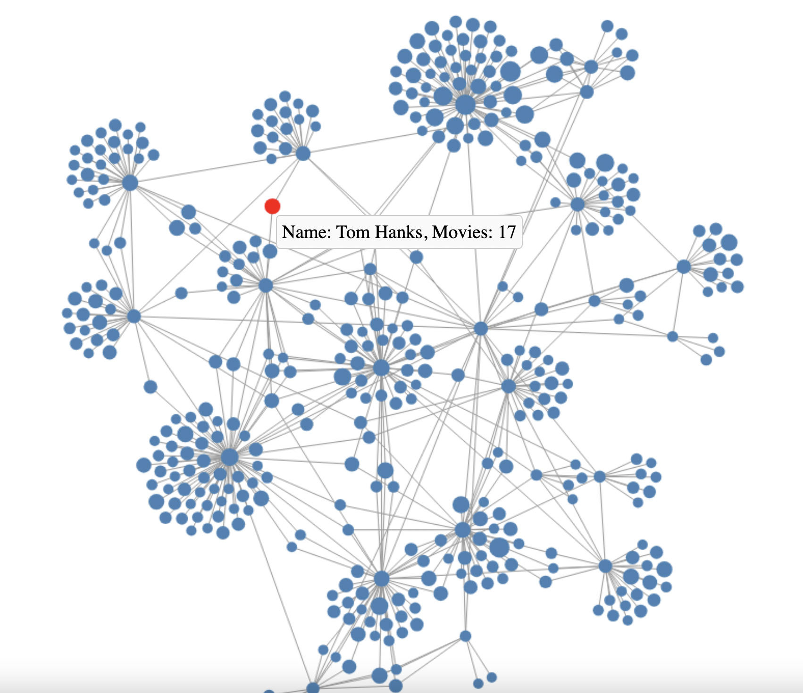

# Coactor Network Graph Visualization
Vast amount of digital data is generated every day, but raw data is often not immediately usable. We are usually more interested in the information content of the data, what pattens are captured?

This repository showcases a project aimed at collecting, preprocessing, and visualizing data using an API from The Movie Database (TMDB) and constructing a graph representation of the data which shows how prolific each actor is and which actors have acted together. The undirected network graph visualization highlights connections between nodes (actors) using D3.js, providing an engaging way to explore relationships and data patterns.




## Motivation
The project serves as a demonstration of:

Data collection and preprocessing skills.
Proficiency in data visualization using modern web technologies.
Effective communication of insights through interactive and dynamic visualizations.
By combining Python for backend processing and D3.js for visualization, this project offers a seamless blend of analytics and presentation.


## Technologies Used
**Backend:**
Python: For data collection, cleaning, and transformation.

**Frontend:**
HTML5 and JavaScript: To structure and power the visualization.
D3.js: A powerful JavaScript library for creating scalable and interactive visualizations.
Canvas API: For efficient rendering of the graph.

## Features
Interactive network graph visualization:
Nodes represent actors, with size scaled by number of highly rated movies to therir credit
Links represent two actors co-starring in a movie, with dynamic scaling for the weigh of the link which represents the number of times the two actors have starred together.

Node interaction:
Hover to display detailed information.
Click to select and highlight nodes.
Drag-and-drop functionality for repositioning nodes.
Optimized rendering using the Canvas API, suitable for large datasets.

## Methodology
**1. Data Collection and Preprocessing**
The `TTMDBAPIUtils` class is implemented to fetch all the data from the API
Version 3 of the API is used.
To use the API:
- Create a TMDB Account and follow the instructions to obtain an authentication token
- Refer to the [TMDB API DOCUMENTATION](https://developer.themoviedb.org/reference/intro/getting-started) which contains helpful 'try it out' features to get acquainted with the API

The two methods in the class namely:
```python
# Method for getting all the cast members for a movie credit using movie credit_id
    def get_movie_cast(self, movie_id: str, limit: int = None, exclude_ids: list = None) -> list:

# Method for getting all the movies for a specific actor using the actor_id
    def get_movie_credits_for_person(self, person_id: str, vote_avg_threshold: float = None) -> list:
```
Details of these methods are included in docstrings within the class

**2. Creating the Network Graph**
The `Graph` class  is used to represent and store the data for the TMDb co-actor network graph.  This class
also provide some basic analytics, i.e., number of nodes, edges, and nodes with the highest degree.

**Each node has the following structure:**
name(name of the actor), id(unique actor id), total_movies(total number of movie credits having a certain rating)

**Each edge has the following structure:**
source actor id, target actor id, count

**The json structure for the graph is as follows:**
```json
{
    "nodes" : [
        {"id" : "1234",
        "name" : "John Doe",
        "movies" : "3"}
    ],
    "links" : [
        {"source" : "1234",
        "target" : "6789"} 
    ]
}
```


The following are the main methods used in the `Graph` class used to store the nodes and links for the network graph

```python
# To add nodes to the network graph which do not already exist
    def add_node(self, id: str, name: str, total_movies: str) -> None:

# To add an edge to the network graph which does not already exist
    def add_edge(self, source: str, target: str) -> None:

# To create the graph json file
    def write_graph_to_json(self, path="graph.json") -> None:
```
Additional details of all these methods are present as docstrings in the `Graph` class

**3. Visualization Design:**

Developed the network graph using D3.js.
- The size of each node is commensurate with the number of highly rated movies (vote_average >= 8.0) the actor has starred in.
- The weight of each edge is commensurate with the number of times two actors have co-starred in a movie together.
- Incorporated interactive features for enhanced user experience.
The entire code D3 can be found in the index.html file

**4. Deployment:**
Integrated the visualization within an HTML page for seamless access.
Structured the project for easy setup and replication.

## Setup Instructions
Follow these steps to run the Project
**1. Clone the Respository**
```bash
git clone https://github.com/asyed79gatech/Coactor-Network-Graph.git
cd Coactor-Network-Graph

```
**2. Prepare and Launch the Envionment**
```bash
source graph/bin/activate
```
**3. Generate/Update the data**
```python
python3 main.py
```
**4. Create an HTTP Port to view the network graph**
```bash
python -m http.server
open index.html
```
**5. Explore the network**
Interact with the visualization to analyze relationships, view detailed information, and adjust the layout.

## Project Structure
```bash
├── main.py         # Python script for data collection and preprocessing.
├── graph.py         # Python script for Graph class.
├── tmdb_api.py         # Python script for TMDBAPIUtils class.
├── index.html           # HTML file containing the D3.js visualization code.
├── graph.json           # JSON file representing nodes and links (generated).
├── nodes.csv         # csv file created to look at the nodes in the graph.
├── edges.csv         # csv file created to look at the edges in the graph.
├── README.md            # Project documentation.

```
## How to Use
Hover over nodes to view key details.
Drag nodes to rearrange them for better visualization.
Click a node to select it, highlighting it for analysis.
Observe relationships through links connecting the nodes.

## Future Enhancements
Add support for real-time data updates.
Enhance styling for improved aesthetics.
Provide downloadable analysis reports directly from the visualization.

## Acknowledgements
Special thanks to the creators of D3.js and the open-source community for inspiring innovative data visualization solutions.

Feel free to use and modify this project for your own purposes. Contributions are always welcome! 😊


